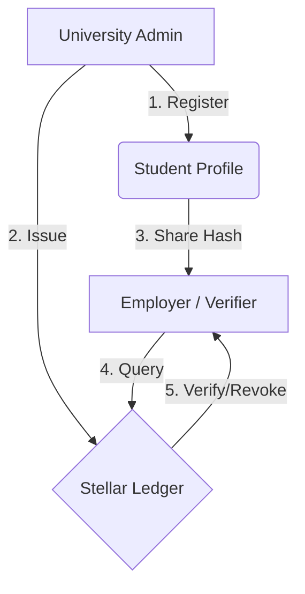

# VeracityLink | The Ledger of Academic Truth
> **VeracityLink** is a next-generation academic registry built on the Stellar network's Soroban smart contracts. It anchors cryptographic proofs of scholarly achievements to an immutable ledger, ensuring that degree documents are tamper-proof and instantly verifiable globally. By eliminating administrative friction and the risk of forgery, VeracityLink establishes a permanent, secure, and decentralized lineage for academic truth.

---

## 🏛️ Ecosystem Overview

**VeracityLink** serves as the decentralized foundation for academic integrity. Universities anchor SHA-256 cryptographic hashes of degree documents directly to the Stellar ledger, enabling a trustless verification ecosystem for students and employers alike.

### 👥 Ecosystem Roles
| Role | Responsibility |
| :--- | :--- |
| **University** | The Master Registrar. Initialises the contract, registers students, and issues/revokes credentials. |
| **Student** | The Identity Owner. Maintains an on-chain profile and shares document hashes with verifiers. |
| **Employer** | The Data Verifier. Uses the Verification Portal to cross-reference claims against the Stellar ledger. |

---

## ⚙️ How It Works



```text
University ──► register_student(name, id_hash)
                    │  profile stored in Persistent storage
                    ▼
University ──► issue_credential(student, doc_hash)
                    │  requires admin_auth
                    │  appends to Credentials(student) Vec
                    ▼
Employer   ──► verify_credential(student, doc_hash)
                    │  Lookup Credentials(student)
                    │  Check doc_hash && is_valid
                    ▼
             Result: VALID ✅ | REVOKED ❌ | NOT_FOUND 🔍
```

---

## 📦 Storage Layout

| Key | Type | Scope | Description |
|---|---|---|---|
| `DataKey::Admin` | `Address` | Instance | The Master Registrar (University) address |
| `DataKey::Students` | `Vec<Address>` | Instance | Global list of registered student addresses |
| `DataKey::Profile(Addr)` | `StudentProfile` | Persistent | Name, Email, and Hashed ID per student |
| `DataKey::Credentials(Addr)`| `Vec<Credential>`| Persistent | List of DocHashes and Revocation flags |

---

## 🧪 Detailed Test Coverage

I have implemented a comprehensive test suite in `src/test.rs` covering 12 critical scenarios:

| Category | Tests |
|---|---|
| **Initialization** | `test_double_initialize_panics` (prevents takeover), `test_initialize_stores_config` |
| **Registration** | `test_credentials_are_per_student` (isolation), `test_many_credentials_for_one_student` |
| **Issuance** | `test_issue_and_verify_single_credential`, `test_duplicate_hash_panics` (prevents replay) |
| **Revocation** | `test_credential_revocation`, `test_revoke_one_credential_leaves_others_intact`, `test_revoke_nonexistent_hash_panics` |
| **Verification** | `test_verify_unknown_hash_returns_false`, `test_multiple_credentials_issuance` |
| **Access Control** | `test_admin_transfer_new_admin_can_issue`, `test_admin_transfer_security` (locks out old admin) |

---

## ⛓️ On-Chain Deployment (Testnet)

| Asset | Details |
| :--- | :--- |
| **GitHub Repository** | [Public repo link with contract source code] |
| **Contract ID** | `CCSVKSIFPWVSO3NICR54BALEXQMOBJOA45IH2F2UADL2JAPKNAB5QN5C` |
| **Stellar Expert** | [View on Explorer](https://stellar.expert/explorer/testnet/contract/CCSVKSIFPWVSO3NICR54BALEXQMOBJOA45IH2F2UADL2JAPKNAB5QN5C) |

---

## ✨ Core Features

*   **🔒 Privacy-First Hashing**: Student IDs and document data are never stored in plain text. Only SHA-256 hashes are anchored.
*   **🛡️ Immutable Issuance**: Credentials are cryptographically linked to the student's Stellar address by the verified University admin.
*   **🚫 Real-Time Revocation**: Universities can instantly invalidate fraudulent or erroneous credentials via a secure on-chain flag.
*   **📂 Multi-Credential Support**: A single student profile can securely store an unlimited number of degrees and certificates.

---

## 🛠️ Step-by-Step Developer Guide

### 1. Set Up Your Environment
Ensure you have the Rust toolchain and Stellar CLI installed.
```bash
# Add WASM target
rustup target add wasm32-unknown-unknown

# Install Stellar CLI
cargo install --locked stellar-cli --features opt
```

### 2. Initialize Project
Clone the repository and prepare the contract environment.
```bash
git clone <repository-url>
cd veracity_link_3.0
```

### 3. Logic & Testing
Implement the contract logic in `src/lib.rs` and validate using the comprehensive test suite.
```bash
# Run unit tests
cargo test
```

### 4. Deploy to Stellar Testnet
Generate identities, fund your account, and deploy the WASM artifact.
```bash
# Generate and fund keys
stellar keys generate --global my-key --network testnet
stellar keys fund my-key --network testnet

# Build & Deploy
cargo build --target wasm32-unknown-unknown --release
stellar contract deploy \
  --wasm target/wasm32-unknown-unknown/release/veracity_link.wasm \
  --source my-key \
  --network testnet
```

---

## 📜 Contract API Reference

### `register_student(student: Address, name: String, id_hash: BytesN<32>)`
Registers a student profile. The `id_hash` is a SHA-256 hash of the university-issued ID number for privacy.

### `issue_credential(student: Address, doc_hash: BytesN<32>)`
*Admin-only.* Appends a unique document hash to the student's credential vector.

### `verify_credential(student: Address, doc_hash: BytesN<32>) -> bool`
*Public View.* Checks if a provided hash exists and is currently marked as valid.

---

## 🎨 Tech Stack
- **Smart Contracts**: Soroban (Rust SDK)
- **Frontend**: React + Vite (Tailwind CSS)
- **Wallet**: Freighter (Stellar)
- **Network**: Stellar Testnet

---

> [!IMPORTANT]
> **Privacy Note**: VeracityLink follows a non-custodial privacy model. Off-chain document metadata (names, GPAs, etc.) should be stored in a secure JSON format, with only the resulting file hash being anchored to the blockchain.

**Created & Designed by Paul Henry Dacalan** 🎓✨🛡️