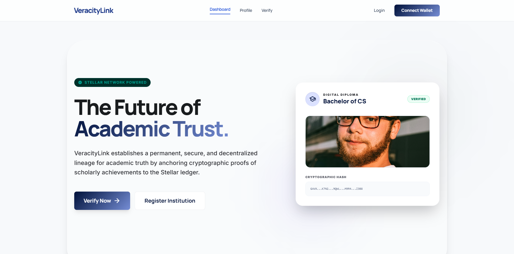
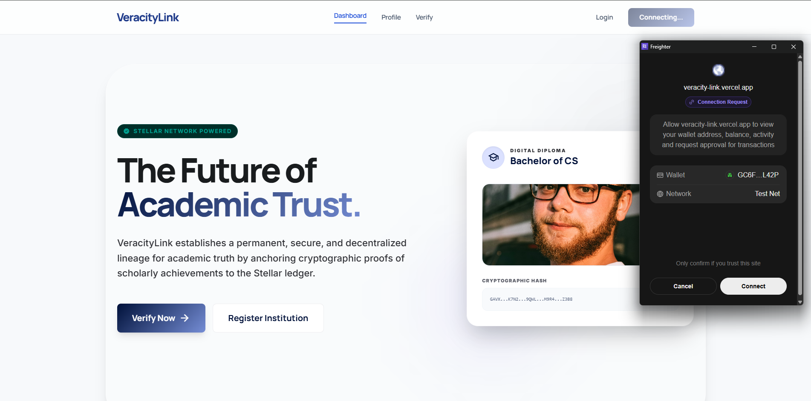
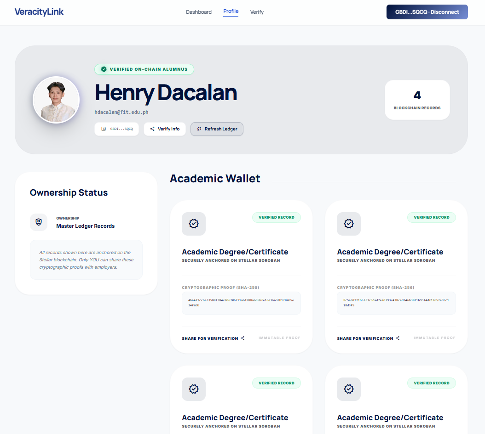
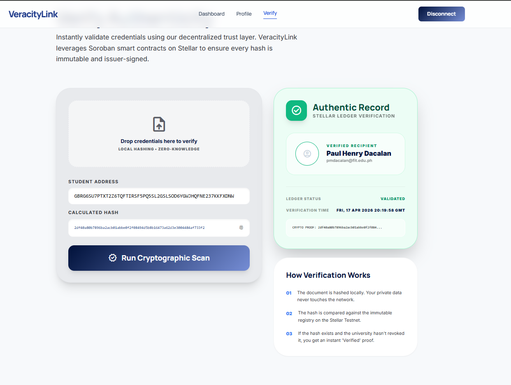
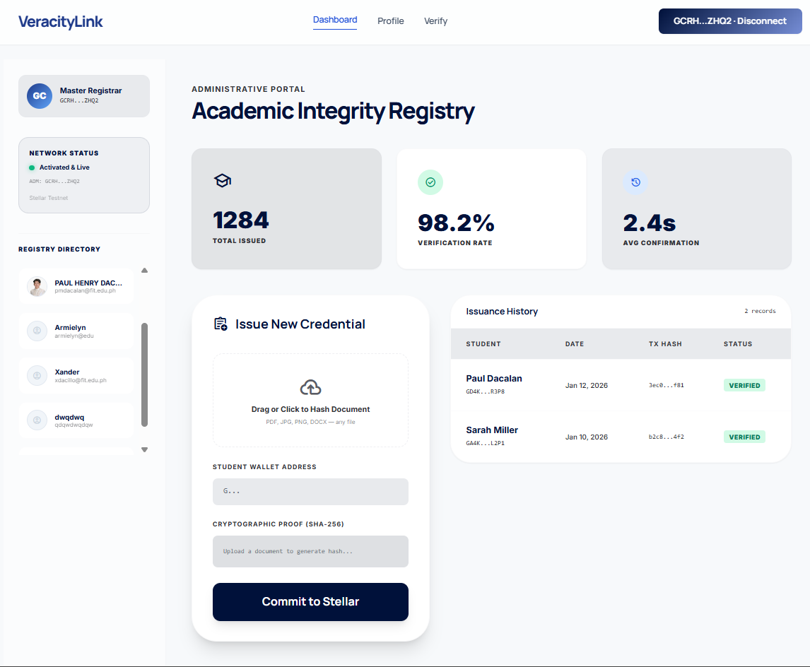
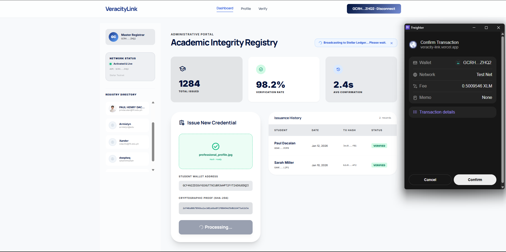
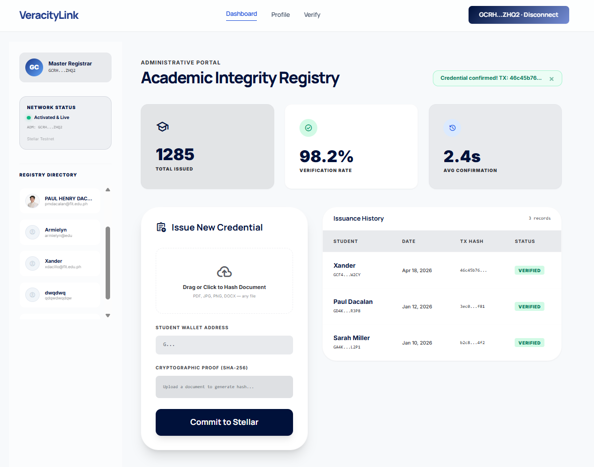

# VeracityLink | The Ledger of Academic Truth

> **The Decentralized Academic Registry.** Trustless credential issuance, on-chain verified diplomas, and instant global verification on the Soroban blockchain.


---

## 🌪️ The Problem
The academic credentialing system is currently broken. Degree verification relies on slow, centralized institutional clearinghouses, physical paper documents are easily forged, and employers spend weeks waiting for background checks to clear. Students have no permanent, portable ownership of their hard-earned academic records.

## 🛡️ The Soroban Solution
VeracityLink leverages the **Stellar (Soroban)** blockchain to create a high-performance, transparent registry for academic credentials.
- **On-Chain Profiles**: Every student is a unique contract entry, storing their verified academic identity directly on the ledger.
- **Cryptographic Anchoring**: Degrees are issued as SHA-256 document hashes, making them globally verifiable and mathematically impossible to forge.
- **Revocation Engine**: Institutions retain the semantic power to revoke erroneously issued credentials without deleting historical ledger records.
- **Instant Finality**: Employers can cryptographically verify any degree in seconds, entirely bypassing slow centralized servers.

---

## 🚀 Core Functions & Features
- **The Verification Portal**: A public, instant validation engine that cross-references provided documents against the Soroban ledger state.
- **Institutional Dashboard**: Secure administrative command center for Universities to issue, manage, and revoke academic hashes.
- **Student Dossier**: A personal verification page where alumni can view and share their cryptographically secured achievements.
- **Role-Based Access**: Strict on-chain authorization ensuring only the Master Registrar (Admin) can issue authoritative credentials.

---

## 📂 Project Structure
```text
VeracityLink/
├── contract/                   # 🦀 Smart Contract Hub (Soroban)
│   ├── src/                    # Rust Source Code
│   │   ├── lib.rs              # Core Registry Logic & Functions
│   │   └── test.rs             # Security & Access Control Test Suite
│   ├── test_snapshots/         # Soroban State Assertions
│   ├── Cargo.toml              # Rust Dependency Management
│   └── README.md               # Contract Deployment & Setup Docs
├── frontend/                   # ⚛️ Web3 Interface (React/Vite)
│   ├── components/             # Tactical UI Components
│   │   └── RegistrationGate.jsx# Access Control Logic
│   ├── context/                # Web3 State Management
│   │   └── StellarWalletProvider.jsx # Universal Sync Engine for Freighter
│   ├── pages/                  # View Layers
│   │   ├── landing_page.jsx    # Public Verification Grid
│   │   ├── student_profile.jsx # Personal Dossier
│   │   ├── admin_login.jsx     # Institutional Access
│   │   └── university_dashboard_admin.jsx # Admin Command Center
│   └── main.jsx                # Application Entry & Routing
├── package.json                # Node/NPM configuration
├── vite.config.js              # Vite bundler parameters
└── README.md                   # Professional Technical Dossier
```

---

## 🏗️ Architecture
```text
Browser (React + Vite)
 |-- Freighter Wallet API     (Transaction signing & Identity)
 |-- @stellar/stellar-sdk     (Transaction building & RPC interaction)
 |-- React Context Provider   (On-chain state management wrapper)

Stellar Testnet
 |-- VeracityLink Soroban Contract (Issuance logic, Verification, Roles)
```

> **Zero Backend Requirement**: VeracityLink has no centralized database. All academic hashes, profiles, and revocation states live natively on-chain. The React frontend mirrors the ledger state for real-time UI updates.

---

- **"Global Registry"**: A single-source-of-truth registry maintained on the Soroban ledger, ensuring all employers see the same validation data instantly.
- **Universal Sync Provider**: A high-performance wallet context on the frontend that auto-syncs on-chain registry state with local React UI.
- **Contract Hardening**: Robust Rust-based logic with exhaustive checks for authorization, duplicate prevention, and access protection.

### Implementation Details:
- **Frontend**: Vite, React 18, React Router, Tailwind CSS (Clean Academic/Corporate UI).
- **Smart Contracts**: Soroban (Rust SDK) deployed on Stellar Testnet.
- **Wallet Integration**: `@stellar/freighter-api` for secure student and admin transaction signing.
- **Hashing**: Web Crypto API (SHA-256) for irreversible document anchoring.

### 🔒 Security, Error Handling & Transactions
VeracityLink implements rigorous on-chain architecture alongside high-fidelity UI tracking to ensure absolute transparency and academic integrity.

**On-Chain Security (Soroban):**
The underlying Rust smart contract strictly handles and reverts invalid states, including:
- `AlreadyInitialized`: Protects against malicious takeover of the Master Registrar role.
- `Unauthorized`: Prevents students or third parties from issuing or revoking credentials.
- `DuplicateHash`: Ensures a specific academic record can only be anchored to a student's profile once.
- `NotFound`: Rejects validation attempts for fraudulent documents or missing profile records.

**Real-Time Transaction Status (Frontend):**
Every interaction (Registering, Issuing, Revoking) relies on our `withTimeout` wrapped wallet provider:
- Verifications occur instantly via local state checks, ensuring rapid employer workflows.
- Successful on-chain modifications instantly refresh local states. Freighter rejections or timeout hangs (e.g. cross-origin blocking) are intelligently caught and routed to graceful UI fallbacks (auto-redirecting to the extension).

---

## 🏗️ Stellar Features Used
| Feature | Usage |
| :--- | :--- |
| **Soroban Smart Contracts** | Immutable credential registry mapping student profiles to document hashes. |
| **Data Storage (Persistent/Instance)** | Robust distinction between global registry state (`DataKey::Admin`, `DataKey::Students`) and individual student records (`DataKey::Profile`, `DataKey::Credentials`). |
| **Stellar SDK v13** | XDR payload parsing, transaction simulation, and seamless RPC integration. |

---

## 📍 Deployment & Contract Addresses
| Layer | Environment | Address |
| :--- | :--- | :--- |
| **Registry Contract** | Stellar Testnet | `CCSVKSIFPWVSO3NICR54BALEXQMOBJOA45IH2F2UADL2JAPKNAB5QN5C` |
| **Network Passphrase**| Stellar Testnet | `Test SDF Network ; September 2015` |
| **Live Web App** | Vercel | `https://veracity-link.vercel.app/` |

---

VeracityLink provides a robust set of **10 on-chain functions** categorized into Administrative Roles, Registry Mutation, and Verification logic.

### 🛡️ Administrative & Governance
| Function | Caller | Description |
| :--- | :--- | :--- |
| `initialize` | **Deployer** | Sets the Master Registrar (Admin) address. Protects the contract via singleton tracking. |
| `get_admin` | **Frontend** | Retrieves the current administrative key for role-gated UI rendering. |
| `transfer_admin` | **Admin** | Transfers master registrar privileges to another institutional key. |

### 🎓 Profile & Registry Mutations
| Function | Caller | Description |
| :--- | :--- | :--- |
| `register_student` | **Student** | Registers basic identity parameters mapping a wallet address to a profile. |
| `issue_credential` | **Admin** | Ascertains authorization, then anchors a new SHA-256 hash to a student dossier. |
| `revoke_credential`| **Admin** | Invalidates a previously issued credential hash without erasing its historical footprint. |

### 📡 Public Verification Queries
| Function | Caller | Description |
| :--- | :--- | :--- |
| `get_student_profile`| **Anyone** | Fetches the public display identity of a verified student. |
| `get_all_students` | **Anyone** | Returns an array of every registered student traversing the network. |
| `get_credentials` | **Anyone** | Retrieves the full list of anchored hashes and their validity statuses for a student. |
| `verify_credential` | **Employer**| Boolean cross-check combining presence and validity to instantly confirm degrees. |

---

## 📦 Prerequisites
- **Node.js**: v18+ 
- **Stellar CLI**: To interact with the smart contracts (`cargo install --locked stellar-cli --features opt`).
- **Freighter Wallet**: Browser extension configured for **Stellar Testnet**.
- **Testnet XLM**: Obtain from the [Stellar Laboratory Friendbot](https://laboratory.stellar.org/#account-creator?network=testnet).

---

## 📜 Smart Contract Setup & Testing
The core logic resides in `contract/src/lib.rs`.

1. **Install Dependencies**:
   ```bash
   rustup target add wasm32-unknown-unknown
   ```

2. **Build the Contract**:
   ```bash
   cd contract
   stellar contract build
   ```

3. **Run Tests**:
   ```bash
   cargo test
   ```
   *Our test suite covers: Authorization validation, Duplicate hash protection, and Revocation propagation.*

---

## 💻 Frontend Local Setup
1. **Clone & Install**:
   ```bash
   npm install
   ```

2. **Configuration**:
   Update your standard `.env` configuration file at the project root for local testing:
   ```env
   VITE_CONTRACT_ID=CCSVKSIFPWVSO3NICR54BALEXQMOBJOA45IH2F2UADL2JAPKNAB5QN5C
   VITE_RPC_URL=https://soroban-testnet.stellar.org
   VITE_NETWORK_PASSPHRASE=Test SDF Network ; September 2015
   ```

3. **Run Locally**:
   ```bash
   npm run dev
   ```

---

### 🧪 Smart Contract Security & Engineering (Test Snapshots)
The VeracityLink core logic is backed by a suite of 12 automated Soroban tests. We utilize ledger snapshots (JSON) to verify state transitions, ensuring academic integrity is never compromised.

| Snapshot Target | Validation Targeted | Strategic Proof |
| :--- | :--- | :--- |
| `test_issue_and_verify...` | **Happy Path** | Verifies proper profile registration, admin issuance, and public validation execution. |
| `test_credential_revocation...` | **Revocation Engine** | Proves employers receive `false` when queried against administratively revoked hashes. |
| `test_multiple_credentials...` | **Data Structure** | Ensures students can maintain massive arrays of varying achievements via vectors. |
| `test_duplicate_hash...` | **Data Integrity** | Blocks multiple identical issuance attempts by the admin, minimizing ledger bloat. |
| `test_admin_transfer...` | **Governance** | Secures operational transfers of master institutional privileges. |

---

### 🚀 Deployment (Testnet)
Once your local tests pass, deploy the finalized WASM to the Stellar Testnet.
```bash
# Generate and fund deployer
stellar keys generate --global my-admin-key --network testnet
stellar keys fund my-admin-key --network testnet

# Compile and ship
cd contract
stellar contract build
stellar contract deploy \
  --wasm target/wasm32-unknown-unknown/release/veracity_link.wasm \
  --source my-admin-key \
  --network testnet
```

---

## 🎬 Live Walkthrough

### 🛡️ Identity & Onboarding
Every student and administrator's journey begins with secure connection pooling via the **Freighter Wallet**. Strict timeout protections handle unresponsive extensions seamlessly in deployed Vercel domains.
| 1. Connect Wallet | 2. On-Chain Auth |
| :---: | :---: |
|  |  |

### 🎓 Student Profile Dossier
A personal command center where graduates can securely view their historically issued credentials and cryptographically verified degrees directly from the ledger.


### 🌐 The Verification Engine
A rapid validation grid allowing anyone to confirm degrees natively using the Soroban ledger RPC endpoints.


### 🏫 Administrative Operations
The Command Center allowing universities to monitor the registered student grid and cryptographically issue new diplomas matching paper graduation records.
| Registry Command Center | Mint/Issue Diploma | Transaction Success |
| :---: | :---: | :---: |
|  |  |  |

---

## 🎨 Tech Stack
- **Smart Contracts**: Soroban (Rust SDK)
- **Frontend**: React + Vite (Tailwind CSS)
- **Wallet**: Freighter (Stellar)
- **Network**: Stellar Testnet

---

## 👥 Target Users
- **Universities / Educational Institutions**: To securely issue degrees via cryptographic hashing with zero ongoing server costs.
- **Students / Alumni**: To establish ownership of an immutable, globally accessible timeline of academic progression.
- **Employers / Background Checkers**: To verify candidate claims in seconds with absolute mathematical certainty, eliminating manual calls to university clerks.

---

## 🧱 Challenges Faced
- **Extension Allow-List Isolation**: Freighter API calls systematically hang when interacting with hosted domains (like Vercel) as opposed to localhost. We engineered a seamless three-pronged fallback sequence using `isAllowed`/`setAllowed` combined with explicit `.race()` timeouts to prevent permanent UI lockouts while preserving the standard UX.
- **Legacy SDK Migration**: Due to changes traversing to `@stellar/stellar-sdk` v13+, we overhauled our XDR envelope decompression mechanics to intelligently decode `Tx(v1)` and `FeeBump` transactions on the fly when parsing simulation payloads.

---

## 🔮 Future Roadmap
- **[ ] Multi-Institutional Access**: Implementing a DAO or multi-signature registry enabling several independent universities to operate under one trust network.
- **[ ] IPFS Integration**: Storing the encrypted JSON representations of the actual degrees and transcripts completely off-chain.
- **[ ] Non-Transferable Tokens (SBTs)**: Upgrading the basic hash validation to natively issue Soulbound Tokens aligned with Stellar Asset Contracts to directly represent specific majors.

---

## 💎 Why Stellar?
- **Speed**: Employers require verification decisions instantaneously; waiting minutes for chain confirmation is unacceptable for HR workflows. Soroban testnet operates in seconds.
- **Immutability**: Degrees absolutely cannot be forged or overwritten once hashed onto the ledger.
- **Frictionless SDK Tools**: Access to the `@stellar/freighter-api` simplified our ability to provide non-crypto-native students with straightforward interactions via browser extension.
- **Predictable Costs**: Micro-validation and mass issuance remain accessible due to Stellar's nearly non-existent network transaction fees.

---

> [!IMPORTANT]
> **Privacy Note**: VeracityLink follows a non-custodial privacy model. Off-chain document metadata (names, GPAs, etc.) should be stored in a secure JSON format, with only the resulting file hash being anchored to the blockchain.

---

***Trust is mathematical. Verification is instant.*** 🎓✨🛡️
Built with passion by **Paul Henry Dacalan** 🚀
